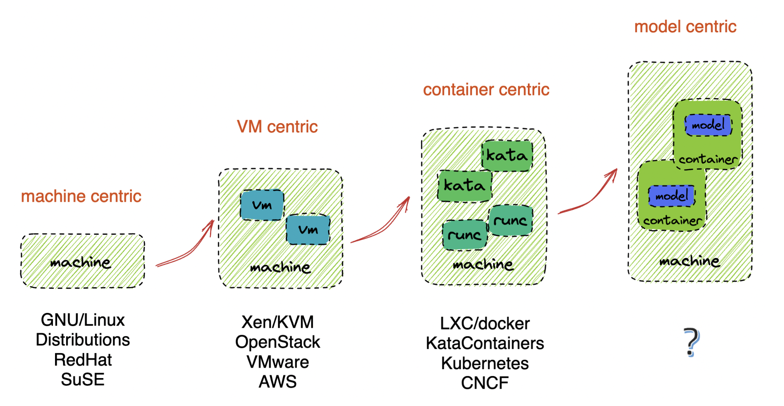

# CNAI Model Specification Proposal

The Cloud Native Artifacial Intelligence (CNAI) Model Specification aims to provide a standard way to package, distribute and run AI models in a cloud native environment.

## Rationale

Looking back in history, there are clear trends in the evolution of infrastructure. At first, there is the machine centric infrastructure age. GNU/Linux was born there and we saw a boom of Linux distributions then. Then comes the Virtual Machine centric infrastructure age, where we saw the rise of cloud computing and the development of virtualization technologies. The third age is the container centric infrastructure, and we saw the rise of container technologies like Docker and Kubernetes. The fourth age, which has just begun, is the AI model centric infrastructure age, where we will see a burst of technologies and projects around AI model development and deployment.

Each of the new ages has brought new technologies and new ways of thinking. The container centric infrastructure has brought us the OCI image specification, which has become the standard for packaging and distributing software. The AI model centric infrastructure will bring us new ways of packaging and distributing AI models. The model specification is an attempt to define a standard to help package, distribute and run AI models in a cloud native environment.

## Current Work

There are two versions of specifications proposed, both of which are under development:

* v1: The first version of the specification, provides a compatible way to package and distribute models based on the current [OCI image specification](https://github.com/opencontainers/image-spec/) and [the artifacts guidelines](https://github.com/opencontainers/image-spec/blob/main/manifest.md#guidelines-for-artifact-usage). For compatibility reasons, it only contains part of the model metadata, and handles model artifacts as opaque binaries. However, it provides a convient way to package AI models in the container image format and can be used as [OCI volume sources](https://github.com/kubernetes/enhancements/issues/4639) in Kubernetes environments.
* v2: The second version of the specification, in a pretty early stage, includes a model image specification and a model runtime specification. The model image specification packages models with details like model artifacts, metadata, configuration, and runtime environment. The model runtime specification defines how to run the packaged models in a cloud native environment. It builds a foundation for promoting AI models as a first-class citizen in the cloud native ecosystem, and let users build once and run anywhere.

We consider the two versions incremental steps toward a standard model specification. The v1 specification is a simple and compatible way to package AI models in the container image format, while the v2 specification is a more comprehensive and cloud native way to package, distribute, and run AI models.

For details, please see [the v1 specification](docs/v1/spec.md) and [the v2 specification introduction](docs/v2/intro.md).

## LICENSE

Apache 2.0 License. Please see [LICENSE](LICENSE) for more information.

## Contributing

Any feedback, suggestions, and contributions are welcome. Please feel free to open an issue or pull request.

Especially, we look forward to integrating the model specification with different model registry implementations (like [Harbor](https://goharbor.io/) and [Kubeflow model registry](https://www.kubeflow.org/docs/components/model-registry/overview/)), as well as existing model centric infrastructure projects like [Kubeflow](https://www.kubeflow.org/), [ollama](https://github.com/ollama/ollama), [Huggingface](https://huggingface.co/), [Lepton](https://www.lepton.ai/), and others.

Enjoy!
