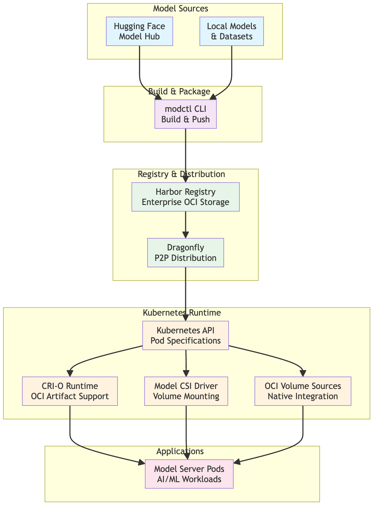

# Getting Started with CNCF ModelPack Specification

Welcome to the CNCF ModelPack Specification project! This guide will help you understand the specification and its role in the broader AI/ML ecosystem, as well as provide practical steps to get started.

## What is the ModelPack Specification?

The CNCF ModelPack Specification is an open standard for packaging, distributing, and running AI models in cloud-native environments. It builds upon the proven [OCI (Open Container Initiative) image specification](https://github.com/opencontainers/image-spec/) to bring the same standardization and interoperability benefits that containers brought to application deployment to the world of AI models.

### Why This Matters

We are entering the fourth age of infrastructure evolution:

1. **Machine-centric** (GNU/Linux distributions)
2. **Virtual Machine-centric** (Cloud computing, virtualization)
3. **Container-centric** (Docker, Kubernetes, OCI standards)
4. **AI Model-centric** (Current era - AI model development and deployment)

Just as OCI standards revolutionized how we package and distribute applications, the ModelPack specification aims to standardize AI model packaging and distribution, moving away from vendor-specific formats toward an open, interoperable standard.

## The ModelPack Ecosystem

The ModelPack specification is designed to integrate seamlessly with existing cloud-native and AI/ML tools. Here's how the key components work together:



### Core Infrastructure

- **[OCI Registries](https://github.com/opencontainers/distribution-spec)**: Store and distribute model artifacts using the same proven infrastructure as container images
- **[Harbor](https://goharbor.io/)**: Enterprise-grade OCI registry that can host model artifacts with security scanning, policy management, and RBAC
- **[Dragonfly](https://d7y.io/)**: Intelligent P2P-based file distribution system for efficient model artifact distribution at scale

### Model Management Tools

- **[modctl](https://github.com/modelpack/modctl)**: CLI tool for building, pushing, pulling, and managing OCI model artifacts
- **[KitOps](https://kitops.ml/)**: ModelKit packaging and deployment platform that supports ModelPack specification

### Kubernetes Integration

- **[Model CSI Driver](https://github.com/modelpack/model-csi-driver)**: Kubernetes CSI driver for mounting model artifacts as persistent volumes
- **[OCI Volume Sources](https://kubernetes.io/blog/2024/08/16/kubernetes-1-31-image-volume-source/)**: Mount model artifacts directly as volumes in Kubernetes pods without init containers
- **[CRI-O](https://cri-o.io/)**: Container runtime that supports OCI artifacts, enabling seamless model deployment in Kubernetes environments

## Key Benefits

- **Standardization**: Use familiar OCI tooling and infrastructure for AI models
- **Interoperability**: Models packaged once work across different platforms and tools
- **Security**: Leverage existing OCI security features like image signing and vulnerability scanning
- **Efficiency**: Native Kubernetes integration eliminates the need for manually downloading models
- **Versioning**: Use OCI tags and digests for robust model version control
- **Ecosystem**: Build on the mature container ecosystem rather than creating new infrastructure

## Getting Started

### Prerequisites

- Basic understanding of containers and OCI concepts
- Access to an OCI-compatible registry (Docker Hub, Harbor, etc.)
- `modctl` CLI tool (for hands-on work)

### Practical Steps

#### 1. Install modctl

Follow `modctl` installation instructions from the [modctl GitHub repository](https://github.com/modelpack/modctl/blob/main/docs/getting-started.md#installation) to install the CLI tool.

#### 2. Install Model CSI Driver

If you plan to use models in Kubernetes, install the Model CSI Driver by following the instructions in the [Model CSI Driver repository](https://github.com/modelpack/model-csi-driver/blob/main/docs/getting-started.md#helm-installation).

#### 3. Package Your First Model

```bash
# Generate a sample Modelfile, and edit the fields as needed
modctl modelfile generate ./my-model-directory

# Build a model artifact from your model files
modctl build -t myregistry.com/mymodel:v1.0 ./my-model-directory

# Push to an OCI registry
modctl push myregistry.com/mymodel:v1.0
```

#### 4. Use Models in Kubernetes

Here's an example Kubernetes pod spec that mounts a model artifact using the model CSI driver. The model will be available under the `/model` directory inside the container.

```yaml
apiVersion: v1
kind: Pod
metadata:
  name: model-inference-pod
spec:
  containers:
    - name: inference-server
      image: ubuntu:24.04
      command: ["sleep", "infinity"]
      volumeMounts:
        - name: model-volume
          mountPath: /model
          readOnly: true
  volumes:
    - name: model-volume
      csi:
        driver: model.csi.modelpack.org
        volumeAttributes:
          modelRef: "myregistry.com/mymodel:v1.0"
```

This example shows how to mount a model artifact directly into a Kubernetes pod using the OCI image volume source.

## Next Steps

1. **Explore the [full specification](./spec.md)** for technical implementation details
2. **Try more options of the [modctl tool](https://github.com/modelpack/modctl)** for hands-on experience
3. **Join the community** on [CNCF Slack #modelpack](https://cloud-native.slack.com/archives/C07T0V480LF)
4. **Contribute** to the ModelPack project - see our [contributing guidelines](../CONTRIBUTING.md)

## Additional Resources

- [OCI Image Specification](https://github.com/opencontainers/image-spec)
- [Harbor Project](https://goharbor.io/)
- [Dragonfly Project](https://d7y.io/)
- [CRI-O](https://cri-o.io/)
- [KitOps](https://kitops.ml/)
- [Hugging Face](https://huggingface.co/)

The ModelPack specification represents the next evolution in infrastructure standardization, bringing the benefits of containerization to AI model management. Start with the basics, explore the ecosystem, and join our growing community of contributors and users building the future of cloud-native AI.
