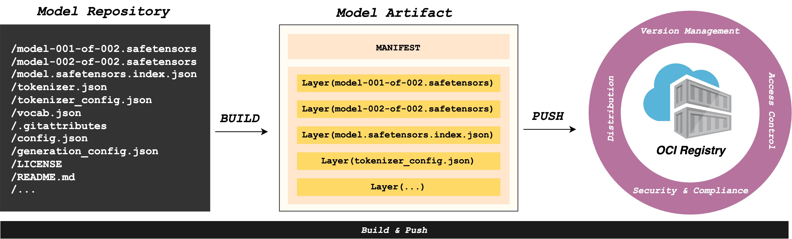

# Model Format Specification

The specification defines an open standard for packaging and distribution of Artificial Intelligence models as OCI artifacts, adhering to [the OCI image specification][image-spec].

The goal of this specification is to outline a blueprint and enable the creation of interoperable solutions for packaging and retrieving AI/ML models by leveraging the existing OCI ecosystem, thereby facilitating efficient model management, deployment and serving in cloud-native environments.

## Use Cases

- An OCI Registry can store and manage AI/ML model artifacts, making model versions, metadata, and parameters both retrievable and easily displayed.
- A Data Scientist can package models together with their metadata (e.g., format, precision) and upload them to a registry, facilitating collaboration with MLOps Engineers while streamlining the deployment process to efficiently deliver models into production.
- A model serving/deployment platform can read model metadata (e.g., format, precision) from a registry to understand the AI/ML model details, identify the required server runtime
  (as well as startup parameters, necessary resources, etc.), and serve the model in Kubernetes by [mounting it directly as a volume source](https://kubernetes.io/blog/2024/08/16/kubernetes-1-31-image-volume-source/)
  without needing to pre-download it in an init-container or bundle it within the server runtime container.

## Overview

At a high level, the Model Format Specification is based on the [OCI Image Format Specification][image-spec] and incorporates [all its components](https://github.com/opencontainers/image-spec/blob/main/spec.md#understanding-the-specification).

### OCI Image Manifest Specification For Model Artifacts

The image manifest of model artifacts follows the [OCI Image Manifest Specification][image-manifest] and adheres to the [artifacts guidance](https://github.com/opencontainers/image-spec/blob/main/artifacts-guidance.md).

- **`mediaType`** _string_

  This REQUIRED property MUST be `application/vnd.oci.image.manifest.v1+json`, refer to the [Guidelines for Artifact Usage](https://github.com/opencontainers/image-spec/blob/main/artifacts-guidance.md).

- **`artifactType`** _string_

  This REQUIRED property MUST be `application/vnd.cnai.model.manifest.v1+json`.

- **`config`** _[descriptor](config.md)_

  This REQUIRED property references a configuration object for a AI/ML model, by digest.

  - **`mediaType`** _string_

    This REQUIRED property MUST be `application/vnd.cnai.model.config.v1+json`.

- **`layers`** _array of objects_

  - **`mediaType`** _string_

    Implementations SHOULD support the following media types:

    - `application/vnd.cnai.model.weight.v1`: The layer is an unarchived, uncompressed model weights file.

    - `application/vnd.cnai.model.weight.v1.tar`: The layer is a [tar archive][tar-archive] that contains the model weight file. If the model has multiple weight files, they SHOULD be packaged into separate layers.

    - `application/vnd.cnai.model.weight.v1.tar+gzip`: The layer is a [tar archive][tar-archive] that includes the configuration file for the model weights. The archive is compressed with [gzip][rfc1952_2].

    - `application/vnd.cnai.model.weight.v1.tar+zstd`: The layer is a [tar archive][tar-archive] that includes the configuration file for the model weights. The archive is compressed with [zstd][rfc8478].

    - `application/vnd.cnai.model.weight.config.v1.tar`: The layer is a [tar archive][tar-archive] that includes config of the model weights like tokenizer.json, config.json, etc.

    - `application/vnd.cnai.model.weight.config.v1.tar+gzip`: The layer is a [tar archive][tar-archive] that includes config of the model weights like tokenizer.json, config.json, etc. The archive is compressed with [gzip][rfc1952_2].

    - `application/vnd.cnai.model.weight.config.v1.tar+zstd`: The layer is a [tar archive][tar-archive] that includes config of the model weights like tokenizer.json, config.json, etc. The archive is compressed with [zstd][rfc8478].

    - `application/vnd.cnai.model.doc.v1.tar`: The layer is a [tar archive][tar-archive] that includes documentation files like `README.md`, `LICENSE`, etc.

    - `application/vnd.cnai.model.doc.v1.tar+gzip`: The layer is a [tar archive][tar-archive] that includes documentation files like `README.md`, `LICENSE`, etc. The archive is compressed with [gzip][rfc1952_2].

    - `application/vnd.cnai.model.doc.v1.tar+zstd`: The layer is a [tar archive][tar-archive] that includes documentation files like `README.md`, `LICENSE`, etc. The archive is compressed with [zstd][rfc8478].

    - `application/vnd.cnai.model.code.v1.tar`: The layer is a [tar archive][tar-archive] that includes code artifacts like scripts, code files etc.

    - `application/vnd.cnai.model.code.v1.tar+gzip`: The layer is a [tar archive][tar-archive] that includes code artifacts like scripts, code files etc. The archive is compressed with [gzip][rfc1952_2].

    - `application/vnd.cnai.model.code.v1.tar+zstd`: The layer is a [tar archive][tar-archive] that includes code artifacts like scripts, code files etc. The archive is compressed with [zstd][rfc8478].

    - `application/vnd.cnai.model.dataset.v1.tar`: The layer is a [tar archive][tar-archive] that includes datasets that may be needed for the lifecycle of AI/ML models.

    - `application/vnd.cnai.model.dataset.v1.tar+gzip`: The layer is a [tar archive][tar-archive] that includes datasets that may be needed for the lifecycle of AI/ML models. The archive is compressed with [gzip][rfc1952_2].

    - `application/vnd.cnai.model.dataset.v1.tar+zstd`: The layer is a [tar archive][tar-archive] that includes datasets that may be needed for the lifecycle of AI/ML models. The archive is compressed with [zstd][rfc8478].

  - **`annotations`** _string-string map_

    This OPTIONAL property contains arbitrary attributes for the layer. For metadata specific to models, implementations SHOULD use the predefined annotation keys as outlined in the [Layer Annotation Keys](./annotations.md#layer-annotation-keys).

### Example Image Manifest For Model Artifacts

```JSON
{
    "schemaVersion": 2,
    "mediaType": "application/vnd.oci.image.manifest.v1+json",
    "artifactType": "application/vnd.cnai.model.manifest.v1+json",
    "config": {
        "mediaType": "application/vnd.cnai.model.config.v1+json",
        "digest": "sha256:d5815835051dd97d800a03f641ed8162877920e734d3d705b698912602b8c763",
        "size": 301
    },
    "layers": [
        {
            "mediaType": "application/vnd.cnai.model.weight.v1.tar",
            "digest": "sha256:3f907c1a03bf20f20355fe449e18ff3f9de2e49570ffb536f1a32f20c7179808",
            "size": 30327160
        },
        {
            "mediaType": "application/vnd.cnai.model.weight.v1.tar",
            "digest": "sha256:6d923539c5c208de77146335584252c0b1b81e35c122dd696fe6e04ed03d7411",
            "size": 5018536960
        },
        {
            "mediaType": "application/vnd.cnai.model.weight.config.v1.tar",
            "digest": "sha256:a5378e569c625f7643952fcab30c74f2a84ece52335c292e630f740ac4694146",
            "size": 106
        },
        {
            "mediaType": "application/vnd.cnai.model.doc.v1.tar",
            "digest": "sha256:5e236ec37438b02c01c83d134203a646cb354766ac294e533a308dd8caa3a11e",
            "size": 23040
        }
    ]
}
```

## Guidance on Layers

This section describes how to serialize AI/ML artifacts into a blob called a layer.

**Implementers' note**: It is recommended to package weight files without compression to avoid unnecessary overhead of decompression by the container runtime as model weight files are typically incompressible.

### `+gzip` Media Types

The `application/vnd.cnai.model.weight.v1.tar+gzip` represents an `application/vnd.cnai.model.weight.v1.tar` payload which has been compressed with [gzip][rfc1952_2]. The mediaTypes `application/vnd.cnai.model.weight.config.v1.tar+gzip`, `application/vnd.cnai.model.doc.v1.tar+gzip`, `application/vnd.cnai.model.code.v1.tar+gzip`, `application/vnd.cnai.model.dataset.v1.tar+gzip` refer to the gzip compressed payloads of their corresponding type.

### `+zstd` Media Types

The `application/vnd.cnai.model.weight.v1.tar+zstd` represents an `application/vnd.cnai.model.weight.v1.tar` payload which has been compressed with the [zstd][rfc8478] algorithm. The mediaTypes `application/vnd.cnai.model.weight.config.v1.tar+zstd`, `application/vnd.cnai.model.doc.v1.tar+zstd`, `application/vnd.cnai.model.code.v1.tar+zstd`, `application/vnd.cnai.model.dataset.v1.tar+zstd` refer to the zstd compressed payloads of their corresponding type.

### File Attributes

Where supported, MUST include file attributes

- Modification Time (`mtime`)
- User ID (`uid`)
  - User Name (`uname`) should be ignored on platforms that support User ID (`uid`)
- Group ID (`gid`)
  - Group Name (`gname`) should be ignored on platforms that support Group ID (`gid`)
- Mode (`mode`)

### Reproducibility

To ensure tar layers are packaged in a reproducible way, implementation SHOULD adhere to the following guidance:

- If the archive includes multiple files, files should be added to the archive in lexicographical order.
- File metadata (such as modification time, owner/group id) should be set to known, constant values rather than the current values on disk.
- Platform/implementation specific metadata should be omitted from the archive.

## Workflow

The model format specification naturally aligns with the standard [OCI distribution specification][distribution-spec].

This section outlines the typical workflow for a model OCI artifact, which consists of two main stages: `BUILD & PUSH` and `PULL & SERVE`.

### BUILD & PUSH

Build tools can package required resources into an OCI artifact following the model format specification.

The generated artifact can then be pushed to OCI registries (e.g., Harbor, DockerHub) for storage and management.



### PULL & SERVE

Once the model artifact is stored in an OCI registry, the container runtime (e.g., containerd, CRI-O) can pull it from the OCI registry and mount it as a read-only volume during the model serving process, if required.


[image-spec]: https://github.com/opencontainers/image-spec/blob/main/spec.md#image-format-specification
[rfc1952_2]: https://tools.ietf.org/html/rfc1952
[tar-archive]: https://en.wikipedia.org/wiki/Tar_(computing)
[image-manifest]: https://github.com/opencontainers/image-spec/blob/main/manifest.md
[rfc8478]: https://tools.ietf.org/html/rfc8478
[distribution-spec]: https://github.com/opencontainers/distribution-spec/blob/main/spec.md
